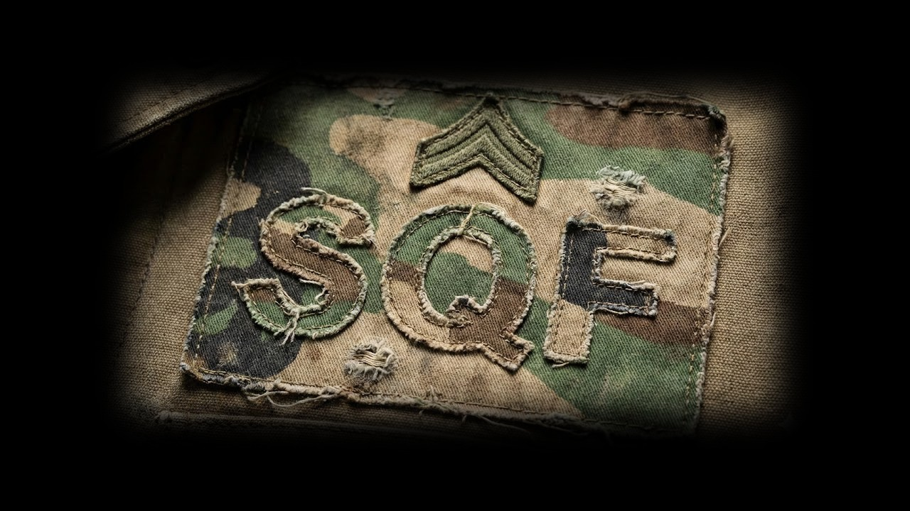

# 🎮 BASE DE MISSION Arma 3 - Multi-Tâches SP/COOP



## 📌 Mode de Jeu : Bac à Sable Tactique et Dynamique (Tactical Sandbox)

Bienvenue dans "Tactical Sandbox" de jeu unique où la liberté tactique est totale. Dès leur arrivée au QG, les joueurs prennent le contrôle complet de leur opération via un ensemble de zones interactives : Armes, véhicules, temps, mission... 

**Le déroulement est simple et intuitif :**
1.  **Préparation :** Équipez-vous à l'arsenal, recrutez des alliés IA ("Frères d'armes") pour renforcer votre escouade et choisissez vos véhicules (terrestres ou aériens).
2.  **Planification :** Configurez l'environnement en modifiant l'heure et la météo selon vos préférences tactiques.
3.  **Mission :** Sélectionnez votre objectif parmi une liste variée de tâches dynamiques (assassinat, extraction, destruction, etc.) via le tableau de commandement (les missions sont cumulables !)
4.  **Action :** Déployez-vous sur le terrain, accomplissez l'objectif et revenez pour préparer la prochaine opération.

Ce scénario est conçu pour être joué en Solo ou en Coopération (1-10 joueurs), offrant une rejouabilité infinie grâce à la modularité des missions et des conditions d'engagement.

---

## 📋 Fonctionnalités Implémentées

| Fonction | Description | Zone Trigger |
|----------|-------------|--------------|
| `fn_spawn_missions` | Menu de sélection des missions avec 20 tâches | `missions_request` |
| `fn_spawn_brothers_in_arms` | Recrutement d'unités IA alliées | `brothers_in_arms_request` |
| `fn_spawn_vehicles` | Spawn de véhicules (pas de bateaux/avions) | `vehicles_spawner` |
| `fn_spawn_weather_and_time` | Contrôle du temps et de la météo | `weather_and_time_request` |
| `fn_spawn_arsenal` | Accès à l'arsenal virtuel | `arsenal_request` |


---

## 🔧 Comment Ajouter une Nouvelle Tâche

### Étape 1 : Ajouter les textes localisés

Dans `stringtable.xml`, ajoutez :

```xml
<Key ID="STR_TASK_2_TITLE">
    <English>Your Task Title</English>
    <French>Titre de votre tâche</French>
    ...
</Key>
<Key ID="STR_TASK_2_DESC">
    <English>Task description...</English>
    <French>Description de la tâche...</French>
    ...
</Key>
```

### Étape 2 : Créer la fonction de tâche

Créez `functions/fn_task_2_launch.sqf` :

```sqf
if (!isServer) exitWith {};

// Créer la tâche Arma 3
[
    true,
    ["task_2_your_id"],
    [localize "STR_TASK_2_DESC", localize "STR_TASK_2_TITLE", ""],
    objNull,      // Position ou objet cible
    "CREATED",
    1,
    true,
    "attack"      // Type: attack, defend, scout, etc.
] call BIS_fnc_taskCreate;

// Votre logique de mission ici...
```

### Étape 3 : Enregistrer dans description.ext

```cpp
class CfgFunctions {
    class MISSION {
        class Localization {
            file = "functions";
            class task_2_launch {};  // Ajouter cette ligne
        };
    };
};
```

### Étape 4 : Connecter au menu de missions

Dans `fn_spawn_missions.sqf`, modifiez :

```sqf
// Section SELECT (lignes ~70-77)
if (_taskNum == 2) then {
    _titleCtrl ctrlSetText (localize "STR_TASK_2_TITLE");
    _descCtrl ctrlSetText (localize "STR_TASK_2_DESC");
};

// Section LAUNCH (lignes ~120-127)
case 2: {
    [] call MISSION_fnc_task_2_launch;
};
```

---

## 📁 Structure des Fichiers

```
mission.sqm           # Fichier mission (éditeur)
init.sqf              # Initialisation
description.ext       # Configuration
stringtable.xml       # Localisation

functions/
├── fn_spawn_missions.sqf
├── fn_spawn_brothers_in_arms.sqf
├── fn_spawn_vehicles.sqf
├── fn_spawn_weather_and_time.sqf
├── fn_spawn_arsenal.sqf
├── fn_task_1_launch.sqf
├── fn_task_x_memory.sqf
└── fn_lang_marker_name.sqf

dialogs/
├── defines.hpp
├── missions_menu.hpp
├── recruit_menu.hpp
├── vehicle_menu.hpp
└── weather_time_menu.hpp
```

---

## 🌍 Langues Supportées

- 🇬🇧 English
- 🇫🇷 Français
- 🇬🇪 Deutsch
- 🇪🇸 Spanish
- 🇮🇹 Italiano
- 🇷🇺 Русский
- 🇵🇱 Polski
- 🇨🇿 Česky
- 🇹🇷 Türkçe
- 🇨🇳 中文
- 🇨🇳 简体中文

---

## 📝 Notes Techniques

- Toute la logique serveur utilise `isServer`
- Les textes UI sont dynamiques via `stringtable.xml`
- Compatible SP et COOP (1-5 joueurs)

### Types d’objectifs de mission à ajouter

- Extraction de VIP : Escorter un officier, scientifique ou informateur jusqu’à la base alliée.
- Récupération de personnel isolé : Secourir un prisonnier de guerre derrière les lignes ennemies.
- Assassinat et récupération de documents : Éliminer un officier ennemi de haut rang. + récuperation de documents dans son inventaire.
- Suppression de défenses : Neutraliser un radar anti-aérien pour permettre un soutien aérien allié.
- Destruction de convoi : Détruire un convoi de ravitaillement ou des véhicules ennemis lourds.
- Reconquête : Reprendre une base alliée (QG ennemie) tombée aux mains de l’ennemi.
- Récupération de renseignements : Infiltrer un QG ennemi pour pirater un ordinateur.
- Enquête mystérieuse : Explorer un laboratoire secret pour comprendre une anomalie.
- localisation d'une bombe avec compteur.

**Options de mission**

- drone de reconnaissance (affiche les positions des unités ennemies)
- présence de tank ennemi 
- soutien aérien allié
- présence civile

**Besoins :** 
 - Officier allié (fait)
 - Officier ennemi avec documents (fait)
 - Officier ennemi mobile
 - QG ennemi (avec ordinateur à pirater)
 - QG allié
 - Radar anti-aérien
 - Convoie ennemie
 - laboratoire secret

## 🎬 Comment gérer des animations (Guide Technique)

### Solution Complète : Code et Implémentation

Cette section détaille comment implémenter une mécanique d'otage fluide, de l'état captif à la libération.

#### Phase 1 : Initialisation de l'Otage (État Captif)

Il ne suffit pas de jouer une animation pour rendre une unité captive. Il faut désactiver ses capacités de réaction pour qu'elle reste dans son rôle.

**Code d'Initialisation** (à placer dans l'init de l'unité ou via script) :

```sqf
params ["_unit"];

// 1. Configuration Logique : Statut Captif
// Empêche les ennemis de tirer sur l'unité.
_unit setCaptive true;

// 2. Désactivation de l'I.A.
// Empêche l'unité de bouger ou de passer en mode combat.
_unit disableAI "ANIM";
_unit disableAI "MOVE";
_unit disableAI "AUTOTARGET";
_unit disableAI "TARGET";
_unit disableAI "FSM";

// 3. Cohérence Visuelle
// Retirer les armes et sacs qui passeraient à travers le modèle.
removeAllWeapons _unit;
removeBackpack _unit;

// 4. Forçage de l'Animation en Boucle
// 'switchMove' force la pose immédiatement sans transition.
_unit switchMove "Acts_ExecutionVictim_Loop";

// 5. Ajout de l'Action de Libération
_unit addAction [
    "Libérer l'otage",
    {
        params ["_target", "_caller"];
        [_target, _caller] execVM "scripts\liberer_otage.sqf";
    },
    [],
    1.5,
    true,
    true,
    "",
    "alive _target && _target distance _this < 2"
];
```

#### Phase 2 : Script de Transition Fluide (`scripts\liberer_otage.sqf`)

Ce script gère la transition cinématique pour éviter que l'IA ne "glitch" lors de la libération.

```sqf
/* 
    Fichier : scripts\liberer_otage.sqf
    Description : Transition fluide de l'état captif à l'état libre.
*/

params ["_captive", "_rescuer"];

// 1. Nettoyage
removeAllActions _captive;

// 2. Animation de Transition (Le Secret de la Fluidité)
// 'Unbow' est l'animation de transition officielle pour sortir de la 'Loop'.
[_captive, "Acts_ExecutionVictim_Unbow"] remoteExec ["switchMove", 0]; 

// 3. Mise à jour du Statut
_captive setCaptive false; 

// 4. Temporisation Critique
// L'animation dure ~8.5s. Il FAUT attendre la fin avant de réactiver l'IA.
sleep 8.5; 

// 5. Réactivation de l'Intelligence Artificielle
{ [_captive, _x] remoteExec ["enableAI", 0]; } forEach ["ANIM", "MOVE", "AUTOTARGET", "TARGET", "FSM"];

// 6. Intégration au Groupe
[_captive] joinSilent (group _rescuer);

// 7. Ordre de Mouvement
_captive doFollow _rescuer;

// 8. Comportement
_captive setBehaviour "SAFE";
_captive setUnitPos "UP"; // Force debout pour éviter qu'il ne rampe tout de suite
sleep 5;
_captive setUnitPos "AUTO";

hint "Otage sécurisé !";
```

## Comment générer une présence civile ? (Système Avancé)

